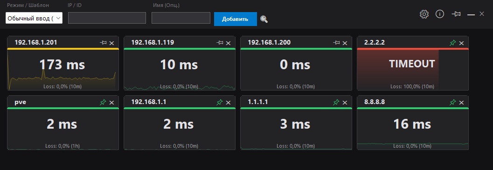
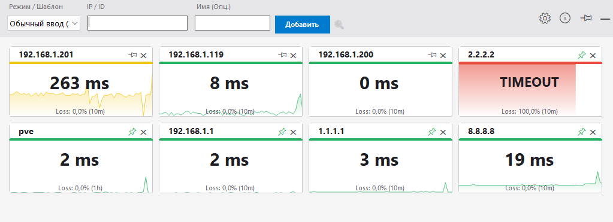
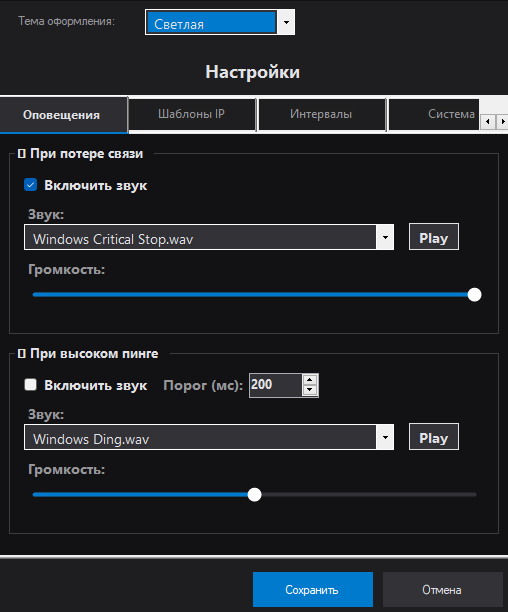
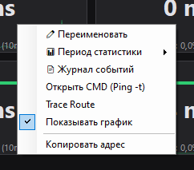
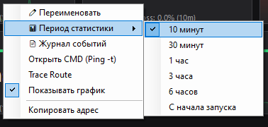
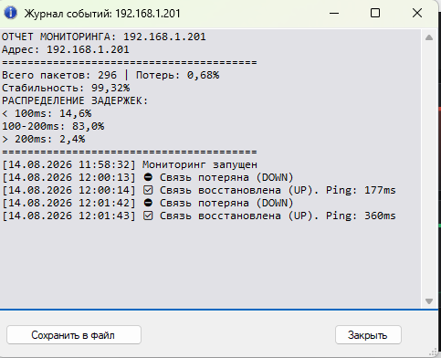

# PingMonitor 🟢🔴📊

[](https://github.com/AlexValyavin/PingMonitor)
[](https://dotnet.microsoft.com/)
[](LICENSE)

**Компактный инструмент для мониторинга доступности сетевых узлов.**  
Одно окно вместо множества `cmd ping -t`. Цветовая индикация, живые графики, звуковые уведомления.



---

## Возможности

- **Цветовые карточки** — статус читается с одного взгляда:
  - 🟢 Зелёный — связь стабильна
  - 🟠 Оранжевый — потери пакетов или высокий пинг
  - 🔴 Красный — узел недоступен (Timeout)
- **Живые графики** — история задержек прямо на плитке узла
- **Логирование** — запись событий (Up/Down), статистика потерь
- **Звуковые уведомления** — настраиваемый звук при потере связи или высоком пинге
- **Шаблоны быстрого ввода** — маски вида `192.168.1.*` или `*.corp.local`
- **Период статистики** — 10 мин / 30 мин / 1ч / 3ч / 6ч / с начала запуска (ПКМ по плитке)
- **Поиск по узлам** — фильтрация плиток по IP или алиасу (🔍)
- **Тёмная и светлая темы** — переключение в настройках
- **Русский / English** — переключение языка интерфейса
- **Автозапуск с Windows** — опция в настройках
- **Drag & Drop** — перетаскивание плиток для изменения порядка
- **Контекстное меню** — журнал, Ping -t, Trace Route, копировать адрес



## Установка

1. Скачайте `PingMonitor.exe` из [Releases](https://github.com/AlexValyavin/PingMonitor/releases)
2. Запустите (не требует установки, portable)

*Требуется .NET Framework 4.7.2+ (есть в Windows 10/11 из коробки)*

## Сборка из исходников

```bash
git clone https://github.com/AlexValyavin/PingMonitor.git
cd PingMonitor
# Откройте .sln в Visual Studio 2022+ или соберите через dotnet build
```

## Скриншоты

| Интерфейс | Описание |
|-----------|----------|
|  | Главное окно (тёмная тема) |
|  | Главное окно (светлая тема) |
|  | Окно настроек |
|  | Контекстное меню плитки |
|  | Выбор периода статистики |
|  | Журнал событий и отчёт |

## Настройки

- ⚙ **Настройки** — звуки, порог пинга, шаблоны, интервалы, тема, язык, автозапуск
- 📌 **Закрепление** — плитки восстанавливаются после перезапуска
- 🖱️ **ПКМ по плитке** — дополнительное меню (журнал, инструменты, период статистики)

## Лицензия

Freeware. Разрешено использование в личных и коммерческих целях. Запрещена продажа программы или её модификаций.